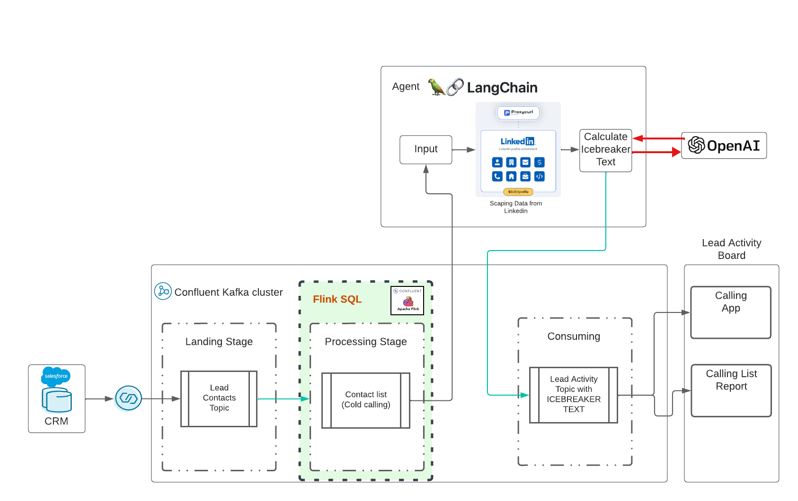
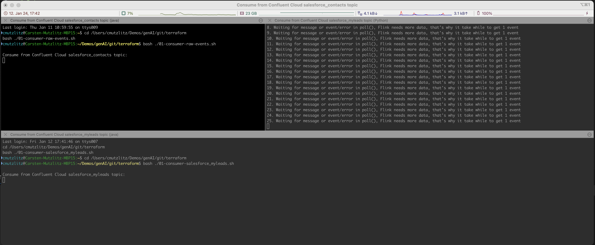
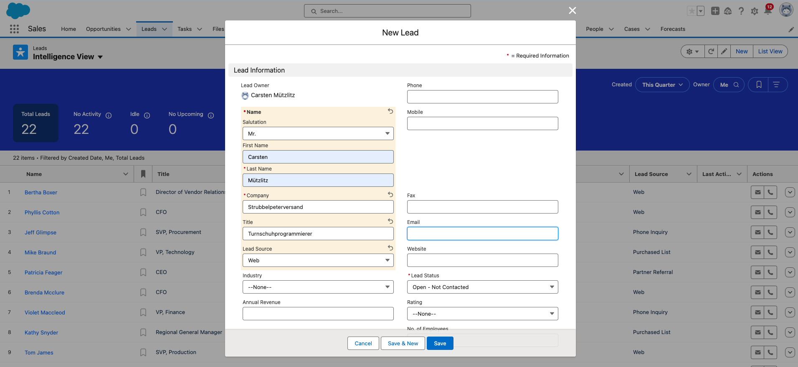
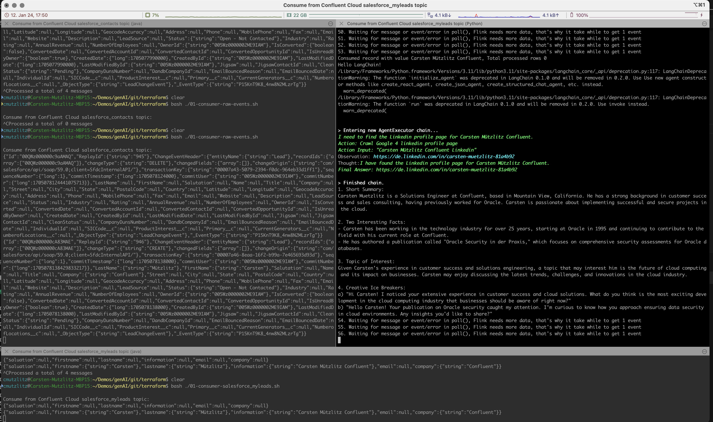

# generative AI with Confluent 

This is a real-time gen AI demo with Confluent Cloud. The idea was formulated by [this](https://www.udemy.com/course/langchain/?referralCode=D981B8213164A3EA91AC) awesome training in Udemy by Eden Marco (LangChain- Develop LLM).

The repo will deploy:
* Confluent CLoud Basic Cluster
* a fully-managedd Salesforce CDC Connector
* Flink SQL Pool
* 2 Topics with Schema
    * salesforce_contacts - coming for CDC Connector (Salesforce)
    * salesforce_myleads - a transformed format with Flink SQL



Please Clone this repository on your desktop:
```bash
cd $HOME # or where-ever directory you want to use
git clone https://github.com/ora0600/genai-with-confluent.git
cd genai-with-confluent/
```

# pre-reqs

The demoing execution is fully automated, but before execution, you need to setup a couple things here:

## Salesforce developer Login

Create a Salesforce Developer account [Signup here](https://developer.salesforce.com/signup)
Configure Salesforce CDC, [see](https://docs.confluent.io/cloud/current/connectors/cc-salesforce-source-cdc.html#quick-start)
Follow my setuo with screenshots [here](setup_salesforce.md)
High level-Steps:
* move to setup, click on the wheel (right upper cornner) 
* search for Change Data Capture in quick search box in Lightning (left side upper field)
* choose entity contact and lead and move to right side (selected entities). The corresponding CDC Name is ContactChangeEvent and LeadChangeEvent
* search for apps and click on App Manager and then New Connected App (right upper corner)
* enter values for the app, and save, click continue 
* click Manager Consumer Details, wait for code via Email and copy consumer key and secret 
* The relevant pieces of information are the Consumer Key and the Consumer Secret
* Click on Manage and change by edit policies and choose IP Relaxation: Relax IP restrictions
* From your personal settings, in the Quick Find box, enter Reset, and then select Reset My Security Token. Click Reset Security Token. The new security token is sent to the email address in your Salesforce personal settings.
* new security token is send via email
* search for oauth and set under OAuth and openID Connect Setting the Allow OAuth User-name-Password Flows to enable
* add connected app to Profile System Administrator: search profile , click on Profiles, edit System Administrator and enable connected app

You need for the Salesforce CDC Connector all the parameters, so please store them safely.

## Confluent Cloud

You need a working account for Confluent Cloud. Sign-up with Confluent Cloud is very easy and you will get a $400 budget for your first trials for free. If you don't have a working Confluent Cloud account please [Sign-up to Confluent Cloud](https://www.confluent.io/confluent-cloud/tryfree/?utm_campaign=tm.campaigns_cd.Q124_EMEA_Stream-Processing-Essentials&utm_source=marketo&utm_medium=workshop).

## Tools

* Install iterm 2, [see](https://iterm2.com/)
* Local install of [Terraform](https://www.terraform.io) (details below)
* Local install Confluent CLI, [install the cli](https://docs.confluent.io/confluent-cli/current/install.html) 
* install Python3 on MacOS: [Downland](https://www.python.org/downloads/macos/) and follow the instructions
    * Install all the python modules we need;
```bash
pip3 install confluent_kafka
pip3 install requests
pip3 install fastavro
pip3 install avro
pip3 install jproperties
pip3 install langchain
pip3 install openai
pip3 install langchain_openai
pip3 install -U langchain-community
pip3 install google-search-results
pip3 install Flask
pip3 install langchain_core
pip3 install pydantic
```

## API Keys from Confluent Cloud Cluster and Salesforce

For Confluent Cloud: Create API Key in Confluent Cloud via CLI:
```bash
    confluent login
    confluent api-key create --resource cloud --description "API for terraform"
    # It may take a couple of minutes for the API key to be ready.
    # Save the API key and secret. The secret is not retrievable later.
    #+------------+------------------------------------------------------------------+
    #| API Key    | <your generated key>                                             |
    #| API Secret | <your generated secret>                                          |
    #+------------+------------------------------------------------------------------+
```

Copy all the Parameter for Confluent Cloud into the `terraform.tfvars` file by execute the following command with your data:
```bash
cat > $PWD/terraform/terraform.tfvars <<EOF
confluent_cloud_api_key = "{Cloud API Key}"
confluent_cloud_api_secret = "{Cloud API Key Secret}"
sf_user= "salesforce user"
sf_password = "password"
sf_cdc_name = "LeadChangeEvent"
sf_password_token = "password token"
sf_consumer_key = "consumer key of connected app"
sf_consumer_secret = "consumer secret of connect app"
EOF
```
Terraform will take all these parameter and doing the configuraiton for you.

## Generative AI API we use

We use langchain LLM vwersion 0.1 [Langchain Docu](https://python.langchain.com/docs/get_started/introduction)

HINT:
<table><tr><td>Now, it costs money, I spend 10$ for openAI, 10$ for ProxyCurl API and SERP API is still in free status.</td></tr></table>

First we need a key which allow us to use OpenAI. Follow steps from [here](https://platform.openai.com/docs/quickstart?context=python) to create API Key only
Next Task: Create proxycurl api key. ProxyCurl will be used to scrape Linkedin. Sign Up to proxyurl and buy credit for 10$ , [Steps](https://nubela.co/proxycurl)
For searchin in Google for the correct linkedin Profile URL we need a key of SEPAPI from [here](https://serpapi.com/).
Now, put all Keys into `env-vars` file by executing the command:
```bash
cat > $PWD/terraform/env.vars <<EOF
export PYTHONPATH=/YOURPATH
export OPENAI_API_KEY=YOUR openAI Key
export PROXYCURL_API_KEY=YOUR ProxyURL Key
export SERPAPI_API_KEY=Your SRP API KEy
EOF
```

Congratulation the preparation is done. This was a huge setup, I know.

# Execute the generative AI Demo with Confluent Cloud, Salesforce and langchain LLM


Execute terraform and everything will deployed automatically:
```bash
cd terraform
terraform init
terraform plan
terraform apply
``` 

This will take a while. The Confluent Cloud Resource will be provision. If this is done iterm2 terminal will be opened automatically and execute the programs.



Ok, now you need to add a new lead into Salesforce.



the generative AI will be generated automatically and in real-time.


If you are finished, you can stop the programs in Terminal with CTRL+c and destroy everything in Confluent Cloud:
```bash
terraform destroy
``` 

If you got an error, execute destroy again, till everything is green.
```bash
terraform destroy
``` 


