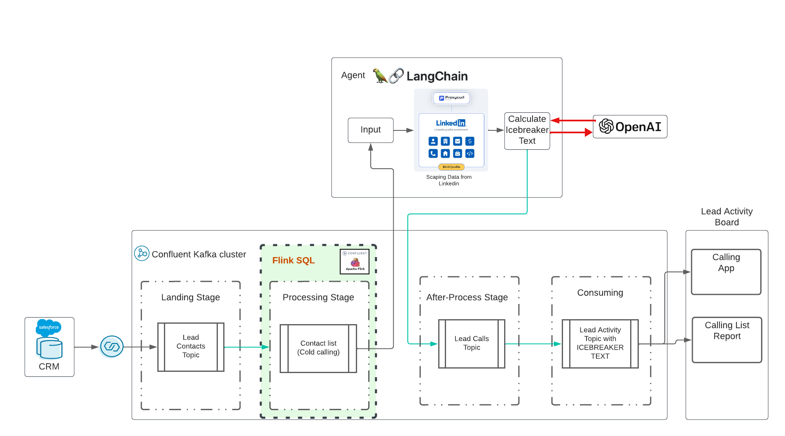

# generative AI with Confluent 

This is a real-time generative AI demo with Confluent Cloud. The idea was influenced by [this](https://www.udemy.com/course/langchain/?referralCode=D981B8213164A3EA91AC) awesome training in Udemy lead by Eden Marco (LangChain- Develop LLM powered applications with LangChain). Eden Marco gave me the promoted link.
Eden Marco do a every good intro into Lngchain LLM development in Python. I took the ice-breaker idea and moved it into a real use case running Data in Motion with Confluent and AI.

The repo will deploy:
* Confluent CLoud Basic Cluster
* a fully-managed Salesforce CDC Connector
* Flink SQL Pool
* 2 Topics with Schema
    * salesforce_contacts - coming for CDC Connector (Salesforce)
    * salesforce_myleads - a transformed format with Flink SQL



Please Clone this repository on your desktop:
```bash
cd $HOME # or what-ever directory you want to use
git clone https://github.com/ora0600/genai-with-confluent.git
cd genai-with-confluent/terraform/
```

# pre-reqs

The demoing execution is fully automated, but before execution, you need to setup a couple things here:

## Salesforce developer Login

Create a Salesforce Developer account [Signup here](https://developer.salesforce.com/signup)
Configure Salesforce CDC, [see](https://docs.confluent.io/cloud/current/connectors/cc-salesforce-source-cdc.html#quick-start)
Follow my setuo with screenshots [here](setup_salesforce.md)
High level-Steps:
* Switch to Setup menu, click on the wheel (right upper cornner) 
* search for Change Data Capture in quick search box in Lightning (left side upper field)
* choose entity contact and lead and move to right side (selected entities). The corresponding CDC Name is ContactChangeEvent and LeadChangeEvent
* search for apps and click on App Manager and then New Connected App (right upper corner)
* enter values for the app, and save, click continue 
* click Manager Consumer Details, wait for code via Email and copy consumer key and secret 
* The relevant pieces of information are the Consumer Key and the Consumer Secret
* Click on Manage and change by edit policies and choose IP Relaxation: Relax IP restrictions
* From your personal settings, in the Quick Find box, enter Reset, and then select Reset My Security Token. Click Reset Security Token. The new security token is sent to the email address in your Salesforce personal settings.
* new security token is send via email
* search for oauth and set under OAuth and openID Connect Setting the Allow OAuth User-name-Password Flows to enable
* add connected app to Profile System Administrator: search profile , click on Profiles, edit System Administrator and enable connected app

You need for the Salesforce CDC Connector all the parameters, so please store them safely.

## Confluent Cloud

You need a working account for Confluent Cloud. Sign-up with Confluent Cloud is very easy and you will get a $400 budget for your first trials for free. If you don't have a working Confluent Cloud account please [Sign-up to Confluent Cloud](https://www.confluent.io/confluent-cloud/tryfree/?utm_campaign=tm.campaigns_cd.Q124_EMEA_Stream-Processing-Essentials&utm_source=marketo&utm_medium=workshop).

## Tools

* install terraform on your desktop. [Follow the installation guide](https://developer.hashicorp.com/terraform/tutorials/aws-get-started/install-cli)
* Install iterm 2, [see](https://iterm2.com/)
* Local install of [Terraform](https://www.terraform.io) (details below)
* Local install Confluent CLI, [install the cli](https://docs.confluent.io/confluent-cli/current/install.html) 
* install Python3 on MacOS: [Downland](https://www.python.org/downloads/macos/) and follow the instructions
    * Install all the python modules we need;
```bash
pip3 install confluent_kafka
pip3 install requests
pip3 install fastavro
pip3 install avro
pip3 install jproperties
pip3 install langchain
pip3 install openai
pip3 install langchain_openai
pip3 install -U langchain-community
pip3 install google-search-results
pip3 install Flask
pip3 install langchain_core
pip3 install pydantic
```

## API Keys from Confluent Cloud Cluster and Salesforce

For Confluent Cloud: Create API Key in Confluent Cloud via CLI:
```bash
    confluent login
    confluent api-key create --resource cloud --description "API for terraform"
    # It may take a couple of minutes for the API key to be ready.
    # Save the API key and secret. The secret is not retrievable later.
    #+------------+------------------------------------------------------------------+
    #| API Key    | <your generated key>                                             |
    #| API Secret | <your generated secret>                                          |
    #+------------+------------------------------------------------------------------+
```

Copy all the Parameter for Confluent Cloud into the `terraform.tfvars` file by execute the following command with your data:
```bash
cat > $PWD/terraform/terraform.tfvars <<EOF
confluent_cloud_api_key = "{Cloud API Key}"
confluent_cloud_api_secret = "{Cloud API Key Secret}"
sf_user= "salesforce user"
sf_password = "password"
sf_cdc_name = "LeadChangeEvent"
sf_password_token = "password token"
sf_consumer_key = "consumer key of connected app"
sf_consumer_secret = "consumer secret of connect app"
EOF
```
Terraform will take all these parameter and doing the configuraiton for you and finally deploy all confluent cloud resources including service accounts and role binding.

## Generative AI API we use

We use langchain LLM version 0.1 [Langchain Docu](https://python.langchain.com/docs/get_started/introduction)

HINT:
<table><tr><td>Now, it will cost money. Unfortunately the API are not for free. I spend 10$ for open AI, 10$ for ProxyCurl API and SERP API is still in free status.</td></tr></table>

First we need a key which allow us to use OpenAI. Follow steps from [here](https://platform.openai.com/docs/quickstart/account-setup) to create an Account and then an API Key only.

Next Task: Create proxycurl api key. ProxyCurl will be used to scrape Linkedin. Sign Up to proxyurl and buy credits for 10$ (or whatever you think is enough, maybe you start more less) , [follow these Steps](https://nubela.co/proxycurl)

To be able to search in Google the correct linkedin Profile URL, we need a API key of SERP API from [here](https://serpapi.com/).

Now, put all Keys into `env-vars` file by executing the command:
```bash
cat > $PWD/terraform/env.vars <<EOF
export PYTHONPATH=/YOURPATH
export OPENAI_API_KEY=YOUR openAI Key
export PROXYCURL_API_KEY=YOUR ProxyURL Key
export SERPAPI_API_KEY=Your SRP API KEy
EOF
```

Congratulation the preparation is done. This was a huge setup, I know.

# Execute the generative AI Demo with Confluent Cloud, Salesforce and langchain LLM
Now comes the easy part. Just execute terraform.
Execute terraform and all confluent cloud resources will deployed automatically:
```bash
cd terraform
terraform init
terraform plan
terraform apply
``` 

This will take a while. The Confluent Cloud Resource will be provision. If this is done, iterm2 terminals will be opened automatically and three services are executed..


Ok, now you need to add a new lead into Salesforce. This is last manual step.


The generative AI will be take new llead from Kafka cluster and do LLM action by getting information from Linkedin and doing execute the prompt automatically and in real-time.


The Prompt will be seen as task for Chatgpt, we formulated taht C>hatgpt should formulate the following content:
* given the Linkedin information {linkedin_information} about a person from I want you to create:
1. a short summary
2. two interesting facts about them
3. A topic that may interest them
4. 2 creative Ice breakers to open a conversation with them

## openai Models

We are running `chatgpt-3.5-turbo` model in this demo. This model has limited tokens, but is currently the fastest and oldest model. And of course the cheapest one.
If you try to use Kai Waehner as a Lead, then you will see that tokens of current model are not enough.
What you can do, is to change the model. This would be simplest way, another method would to split content into chunks. 
Please have a look of current [models](https://platform.openai.com/docs/models/overview) to check the amount tokens per model.

### Test

I start with my tests:

* Enter Carsten Mützlitz in Salesforce as new Lead: It will take around x seconds to complete task, and will finish successfully
* Enter Kai Waehner in Salesforce as new Lead
  * Chatgpt will break because token limits exceeded
  * change model to `model_name="gpt-3.5-turbo"` in ice_breaker.py line 135 and restart the client.
  * Re-enter Kai Waehner
  * Now, tokens are not a problem anymore for this case

The simple demo is no use case for Retrieval Augmented Generation (RAG) pattern to my opinion. We get all information from a given API and it makes no sense to store the data into a vector DB. It is much more efficient to load the information via API in realtime, then it is fresh data. Use the right model for your use case, in our case it should be a fast model with higher amount of tokens.

## Troubleshooting

Salesforce is reset your password and you need to change it from time to time.
If you change the password you also get a new password security token.
Please do not forget to change this in `terraform.tfvars` file.

# Destroy the Confluent Cloud Resources
If you are finished, you can stop the programs in Terminal with CTRL+c and destroy everything in Confluent Cloud:
```bash
terraform destroy
``` 

If you got an error, execute destroy again, till everything is deleted, then you pretty sure, that no resources is running and consume costs.
```bash
terraform destroy
``` 

# Licenses
You need a Confluent Cloud Account (new ones get 400$ credit for free).
You need an OPenAI Account, with current credit.
You need a ProxyCurl API Account, with current credits.
Your need SERP API Account, here you will a starting amount of connections. This was enough in my case.

In  Total I spend 20 $ (Open AI, ProxyCurl) and I am still not out of credits.

