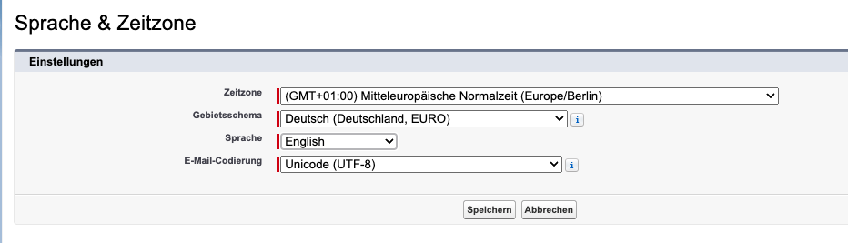
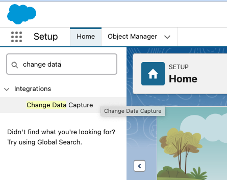
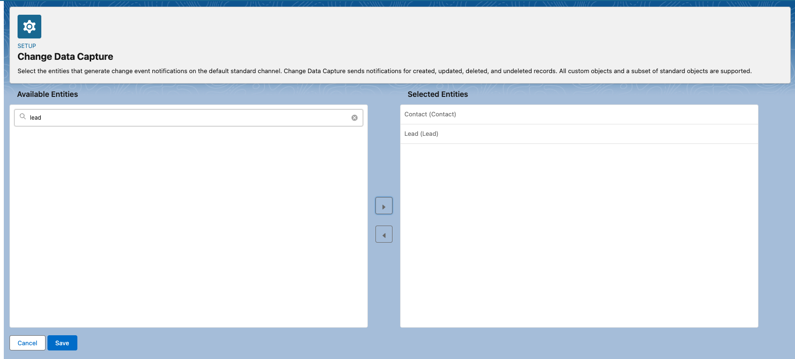
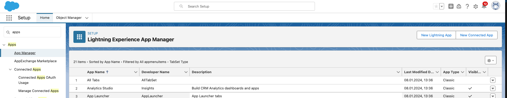
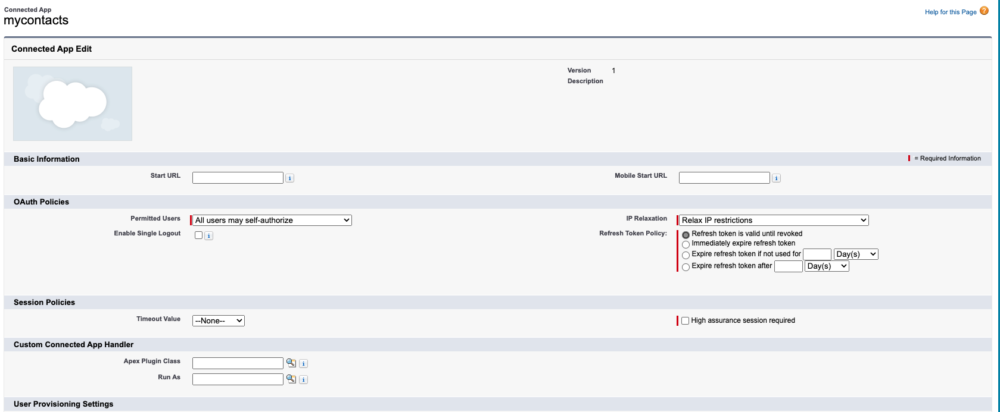
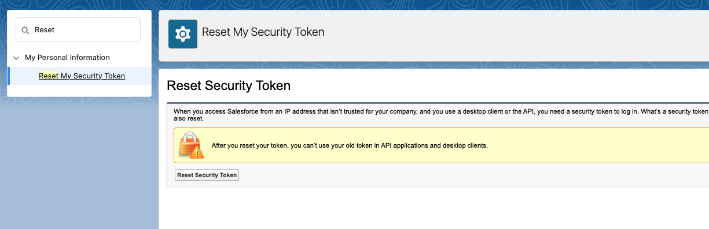
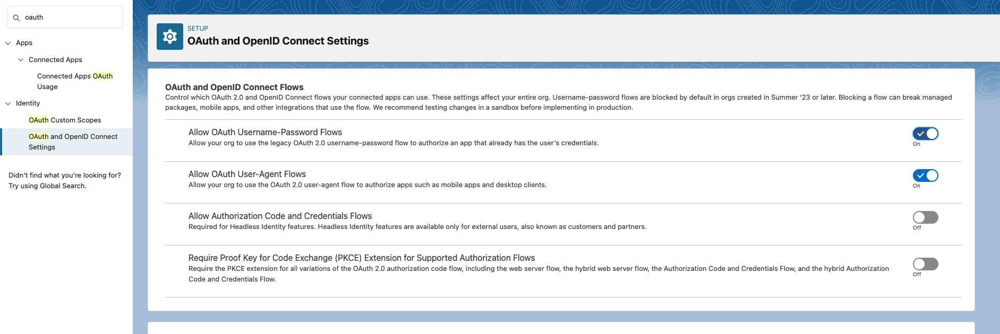
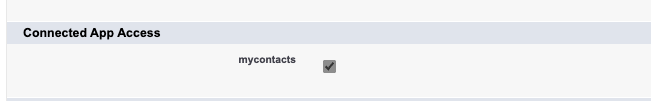

# Setup Salesforce
Start with Developer Account Signup [here](https://developer.salesforce.com/signup)

In our documentation you will find a c ouple of entries how to confgure Salesforce CDC:
* Configure Salesforce CDC: see [docu](https://docs.confluent.io/cloud/current/connectors/cc-salesforce-source-cdc.html#quick-start)
* Configure SALESFORCE for CDC [follow](https://developer.salesforce.com/docs/atlas.en-us.change_data_capture.meta/change_data_capture/cdc_select_objects.htm)
* Follow this setup from [Vincent](https://github.com/vdesabou/kafka-docker-playground/tree/master/connect/connect-salesforce-cdc-sourcesalesforcesalesforceCDC)

Here are my steps with current screenshots (Jan. 2024):
first setup language to english  (Setting under User) 



move to setup, click on the wheel (right upper corner) 
search for Change Data Capture in quick search box in Lightning (left side upper field) 




choose entity contact and lead and move to right side (selected entities) 



The corresponding CDC Name is ContactChangeEvent and LeadChangeEvent
My user is system administrator
search for apps and click on App Manager and then New Connected App (right upper corner) 



enter values for the app, and save click continue 


click Manager Consumer Details, wait for code via Email and copy consumer key and secret 
Sacve Consumer key and sceret
The relevant pieces of information are the Consumer Key and the Consumer Secret
Click on Manage and change by edit policies and choose IP Relaxation: Relax IP restrictions  




From your personal settings, in the Quick Find box, enter Reset, and then select Reset My Security Token. Click Reset Security Token. The new security token is sent to the email address in your Salesforce personal settings. 



new security token is send via email, save password security token

search for oauth and set under OAuth and openID Connect Setting the Allow OAuth User-name-Password Flows to enable  



add connected app to Profile System Administrator: search profile , click on Profiles, edit System Administrator and enable connected app 



Now you evrything configured and can setup the Salesforce parameters for the connector in `terraform/terraform.tfvars`:
```bash
 sf_user = "salesforce user"
 sf_password = "password"
 sf_cdc_name = "LeadChangeEvent"
 sf_password_token = "password token"
 sf_consumer_key = "consumer key of connected app"
 sf_consumer_secret = "consumer secret of connect app"
```
The

Salesforce CDC configuration is finished. goto [Main Readme](README.md)